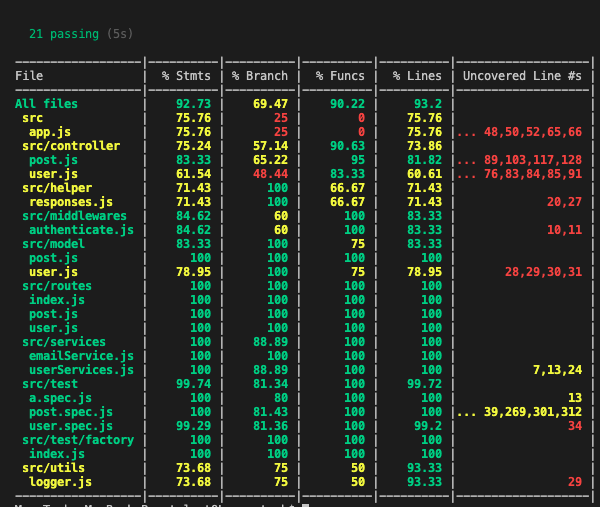

# Share content

This is a simple facebook post restful api backend functionalities. It enables users to register, login, share content, comment on a content, List of user,  List of post, subscribe, like a post , undo like a post

##

API Endpoint: 

# Technologies Used

- Backend: Node/Express
- MongoDB
- Libaries: Es6, Babel-CLI, eslint, supertest, express ...

# Features

- User can create an account and log in
- Authenticated User create content/post.
- Authenticated User like a post .
- Authenticated User undo post like.
- Authenticated User comment on a post.
- Authenticated User subscribe to a post.
- Authenticated User update a post.
- Authenticated User delete a post.
- unauthenticated/Authenticated User should be able get all post.
- unauthenticated/Authenticated User should be able view a post.

## API Endpoints

| Endpoint                                          | Functionality                       |
| ------------------------------------------------- | ----------------------------------- |
| POST /api/signup                                  | Register a user                     |
| POST /api/login                                   | Login a user                        |
| GET /api/users                                    | List all user                      |
| GET /api/change_password                                    | change password                      |
| GET /api/user/\<id>                                    | View a user                      |
| POST /api/post                       | Create post                   |
| GET /api/posts                       | List all post                  |                                |
| PATCH /api/post/like             | like a post                  |
| PATCH /api/post/undolike            | undo post like                  |
| PATCH /api/post/comment            | comment on a post   
| PATCH /api/post/subscribe            | subscribe to a post                |                   |
| PUT /api/post/\<postId>            | update a post                  |
| DELETE /api/post/\<postId>            | delete a post                  |




#
```
Noted you need to create an account on https://postmarkapp.com/ to get sign up email
notification

```

# API Documentation: baseurl/api-docs

```
Goto to /src/doc/swagger.json file update "host": "localhost:3030", to your environment baseurl
```

# To Install

- Download or clone
- Open terminal inside the root directory of clone folder
- Type `npm install` to install all dependencies
- `npm start` to run the app for production
- `npm run dev` to run development environment
- `npm test` to run the test suits on the app

##

API Endpoint: 

## AUTHOR

[Kayode Adeyemi](https://github.com/karosi12)
